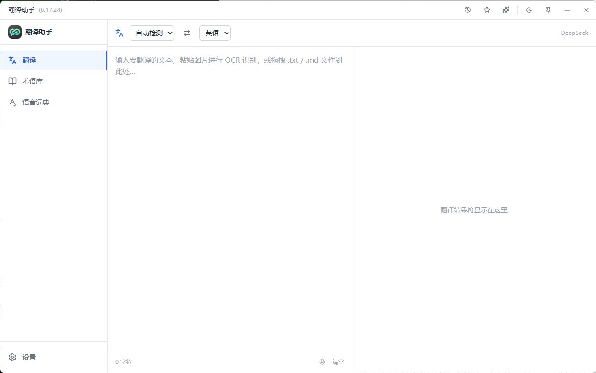
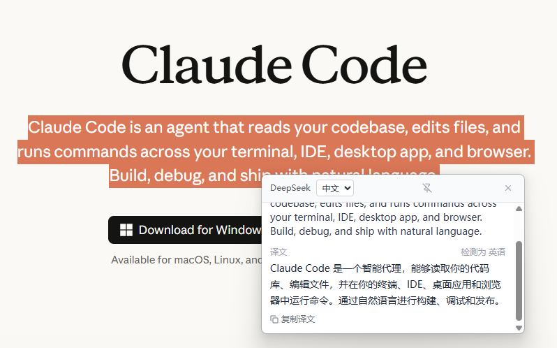
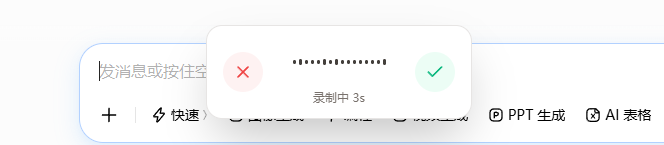

<div align="center">


# 翻译助手 · Translation Assistant

**一款常驻桌面、贴着工作流走的 AI 翻译工具**

输入即翻译 · 选中即翻译 · 截图即翻译 · 开口即翻译

[](./LICENSE)
[](#-快速开始)
[](https://www.electronjs.org/)
[](https://react.dev/)
[](https://www.typescriptlang.org/)
[](https://github.com/satan112233/translation-assistant)

</div>

---

## 🌟 为什么选择翻译助手？

市面上的翻译工具，要么是网页要切来切去，要么只支持复制粘贴。**翻译助手是一个常驻系统托盘的桌面应用**，把翻译这件事彻底融进你的日常操作里——不管你在浏览器、文档、IDE 还是聊天软件，一个快捷键就能翻译、改写、转写，**不打断、不切换、不等待**。

它接入你自己的大模型 API（DeepSeek / OpenAI / Gemini / 智谱），翻译质量由顶尖 LLM 保证；OCR 与语音识别可完全离线运行，**隐私数据不出本机**。

---

## ✨ 亮点速览

| | 功能 | 一句话 |
|---|---|---|
| 🖱️ | **划词翻译** | 任意软件里选中文字，按 `Ctrl+Alt+C`，鼠标旁立刻弹出译文 |
| 🎙️ | **三键语音魔法** | 说话转文字 / 语音指令改写选中文本 / 开口即得译文，全局可用 |
| 📸 | **截图 OCR 翻译** | 截图后 `Ctrl+V` 粘贴，离线识别图中文字并翻译，带标点 |
| 🧠 | **口语智能优化** | AI 自动去填充词、识别改口、转标点、纠正专有名词 |
| ⚖️ | **多模型对比** | 同时调用多个大模型，并排比较谁翻得更好 |
| 📖 | **术语库 / 语音词典** | 锁定专业术语译法、纠正人名品牌识别，结果始终如你所愿 |
| 🔒 | **本地优先** | OCR 与语音识别可完全离线，翻译走你自己的 API Key |
| 🌗 | **轻巧顺手** | 无边框窗口、深浅色主题、系统托盘常驻、全局快捷键 |

---

## 🖼️ 界面预览

<div align="center">
  
  <br /><br />
  
  <p><sub>↑ 主界面　·　划词翻译：任意软件选中文字即弹出译窗</sub></p>
</div>

<!-- 还可继续补充语音浮层等截图，例如：
<div align="center">
  
</div>
-->

---

## 📦 核心功能详解

### 🔤 多种翻译入口，覆盖每个场景

- **主窗口翻译**：中 / 英 / 日 三语互译，输入即译（600ms 防抖），无需点击。源语言可设「自动检测」，并**自动选择目标语言**（输入中文自动译英、输入英文自动译中），告别「中译中」尴尬。一键交换源 / 目标语言。
- **划词翻译**：任意软件中选中文字 → `Ctrl+Alt+C` → 鼠标附近弹出迷你译窗。弹窗可切换目标语言、一键复制，还能 📌 **固定（Pin）**不自动关闭，方便对照。
- **截图 OCR 翻译**：`Win+Shift+S` 截图后在输入框 `Ctrl+V` 粘贴，基于本地 **RapidOcrOnnx（PaddleOCR）** 离线识别中英混排文字（带标点）并翻译。
- **文档翻译**：直接把 `.txt` / `.md` 文件拖进输入区，自动读取并翻译，可导出结果为 `.txt`。

### 🎙️ 三键语音，让说话替你打字

三个全局快捷键，**在翻译助手内外的任意窗口都能用**（浏览器、编辑器、聊天框……）：

- `Ctrl+Alt+V` **语音输入** — 说话，粘贴识别后的文字。
- `Ctrl+Alt+D` **语音编辑** — 先选中任意 App 里的一段文本，按下后说出指令（「改短一点」「更正式」「翻译成英文」「修正语法」），AI 改写后直接替换原文。
- `Ctrl+Alt+F` **语音直译** — 说一种语言，自动翻成另一种语言后粘贴，零配置。

录音时屏幕底部弹出**圆角药丸录音浮层**（应用内外样式统一），带由真实麦克风音量驱动的声波动画，左取消 / 右完成。支持 **智谱 AI ASR、科大讯飞 ASR、本地 Sherpa-onnx**（SenseVoice，中/英/日/韩/粤语，完全离线）三种识别引擎。

### 🧠 口语内容智能优化（DeepSeek 驱动）

开启后，AI 会把口语化的识别结果润色为自然、清晰、流畅的文本，同时保留你的原意：

- **智能改口识别**：说「三点……不对，是十点」时，只保留最终正确的表述。
- **标点口令 & 自动格式化**：说「逗号 / 句号 / 换行 / 新段落」转成真标点，并列要点自动整理成列表。
- **术语词典纠错**：自动参考术语库和语音词典里的专有名词、品牌、专业词，纠正读音相近但拼错的词。

### ⚖️ 多模型对比 & 多提供商

- 内置 **DeepSeek、OpenAI、Gemini、智谱 AI** 四个提供商，均走 OpenAI 兼容接口。
- 配置 ≥2 个 API Key 后开启「对比翻译模式」，**同时调用多个模型**，结果卡片并排展示，单个失败不影响其他。

### 📖 术语库 & 收藏 & 历史

- **术语库**：为专业术语、品牌名指定固定译法，翻译时注入 Prompt，模型优先遵循。
- **语音词典**：单独录入常说的人名、缩写、项目代号，专用于语音识别纠错。
- **收藏夹**：⭐ 一键收藏，支持搜索、备注、导出 `.txt`，不受历史条数限制。
- **翻译历史**：自动保存最近 20 条，一键回填，支持删除 / 清空。

### ✨ 翻译结果增强

- 自然译文 + **读音**（日文罗马音 / 英文音标）+ 最多 **3 条备选译法** + 源语言检测。
- 翻译结果支持 **TTS 朗读**，根据目标语言自动选语音。

### 🎨 顺手的外观与交互

- **浅色 / 深色 / 跟随系统** 三种主题。
- 无边框窗口 + 自定义标题栏，支持窗口置顶。
- 左侧侧边栏（翻译 / 术语库 / 语音词典，设置固定底部）+ 标题栏抽屉（历史 / 收藏 / 语音优化记录右侧滑出）。
- `Ctrl+Alt+T` 全局显隐主窗口，最小化到系统托盘常驻。

---

## ⌨️ 快捷键

| 快捷键 | 说明 | 可自定义 |
| --- | --- | :---: |
| `Ctrl + Alt + T` | 显示 / 隐藏主窗口 | ✅ |
| `Ctrl + Alt + C` | 划词翻译（任意窗口选中文字后触发） | ✅ |
| `Ctrl + Alt + V` | 语音输入（应用内 / 外均可） | ✅ |
| `Ctrl + Alt + D` | 语音编辑（选中文本后用语音指令改写） | — |
| `Ctrl + Alt + F` | 语音直译（说一种语言出另一种语言译文） | — |

> 自定义方式：设置 → 全局快捷键，点击输入框后按下新组合键即可。

---

## 🚀 快速开始

### 环境要求

- Windows 10 / 11
- Node.js 20+
- 任意一个 OpenAI 兼容的 API Key（推荐 [DeepSeek](https://platform.deepseek.com/)，便宜好用）

### 安装与运行

```bash
# 克隆项目
git clone https://github.com/satan112233/translation-assistant.git
cd translation-assistant

# 安装依赖
npm install

# 开发模式运行
npm run dev
```

### 配置 API Key

1. 打开应用，点击左侧「设置」。
2. 在「默认翻译模型」中选择提供商（DeepSeek / OpenAI / Gemini / 智谱 AI）。
3. 填写 **API Key**（Base URL 与模型已预填默认值，一般无需修改）。
4. 离开设置页自动保存，即可开始翻译。

### 语音识别准备（可选）

| 方式 | 说明 | 需要配置 |
| --- | --- | --- |
| **智谱 AI ASR**（推荐） | 云端 `glm-asr-2512`，开箱即用 | 智谱 API Key |
| **科大讯飞 ASR** | 中文场景准确率更高 | AppID / APIKey / APISecret |
| **本地 Sherpa-onnx** | 完全离线，带标点与数字规范化 | 见下方说明 |

<details>
<summary>本地 Sherpa-onnx 部署步骤</summary>

1. 从 [sherpa-onnx releases](https://github.com/k2-fsa/sherpa-onnx/releases) 下载 Windows x64 预编译包（如 `sherpa-onnx-v1.13.2-win-x64-shared-MD-Release-no-tts.tar.bz2`）。
2. 将 `bin/sherpa-onnx-offline.exe` 及依赖 DLL（`onnxruntime.dll`、`onnxruntime_providers_shared.dll`、`sherpa-onnx-c-api.dll`、`sherpa-onnx-cxx-api.dll`）放到项目 `resources/sherpa-onnx/`。
3. 首次使用语音输入时，应用自动从 GitHub 下载 SenseVoice 模型（约 160MB）到用户数据目录。打包时 `resources/sherpa-onnx/` 会随安装包一起分发。

</details>

> 如开启「口语内容优化」，还需配置 DeepSeek API Key 用于润色识别结果。

### 打包为安装程序

```bash
npm run dist   # 生成 Windows 安装程序（.exe），产物在 release/ 目录
```

---

## 🛠️ 常用命令

```bash
npm run dev        # 开发模式
npm run typecheck  # 类型检查
npm run build      # 构建生产包
npm run preview    # 预览生产构建
npm run dist       # 打包 Windows 安装程序
```

---

## 🏗️ 技术栈

**Electron** · **Vite / electron-vite** · **React 19** · **TypeScript** · **Tailwind CSS** · **Zustand** · **electron-store** · **koffi**（Windows 原生 API）· **RapidOcrOnnx**（离线 OCR）· **Sherpa-onnx**（离线语音识别）· **DeepSeek**（口语优化 / 翻译）

---

## 📁 项目结构

```
translation-assistant/
├── src/
│   ├── main/        # Electron 主进程：窗口、托盘、LLM 请求、OCR、ASR
│   ├── preload/     # Preload 脚本（CJS），暴露安全 IPC 桥接
│   ├── renderer/    # React 渲染层（components / hooks / stores）
│   └── shared/      # 主 / 渲染共享类型
├── resources/       # RapidOcrOnnx、Sherpa-onnx 等本地二进制与模型
├── electron.vite.config.ts
└── package.json
```

---

## 🤝 参与贡献

欢迎 Issue 与 PR！发现 bug 或有新想法，先在 Issue 中描述问题或提案，我们一起把它做得更好。

## 📄 许可证

本项目基于 [MIT](./LICENSE) 许可证开源。

---

<div align="center">

如果这个项目帮到了你，欢迎点个 ⭐ Star 支持一下！

</div>
